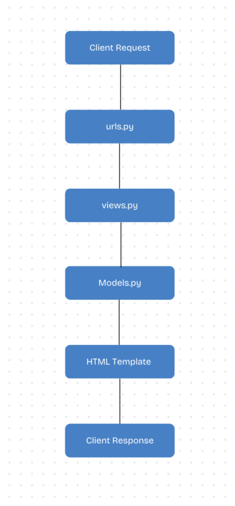
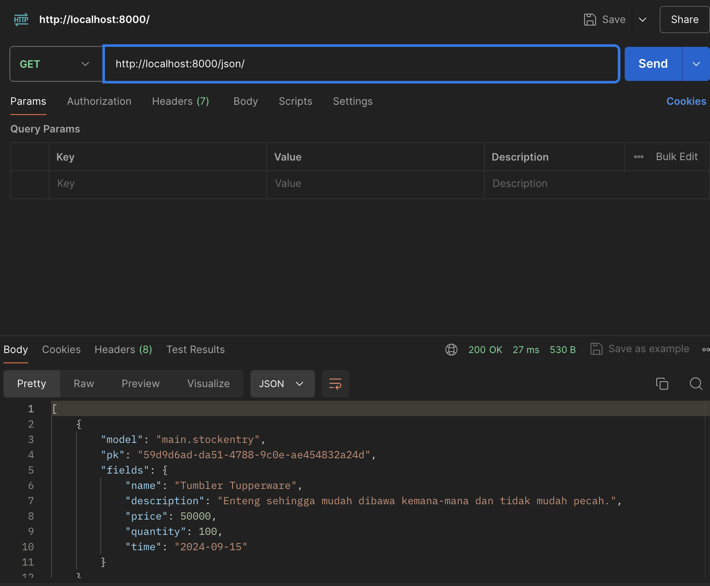
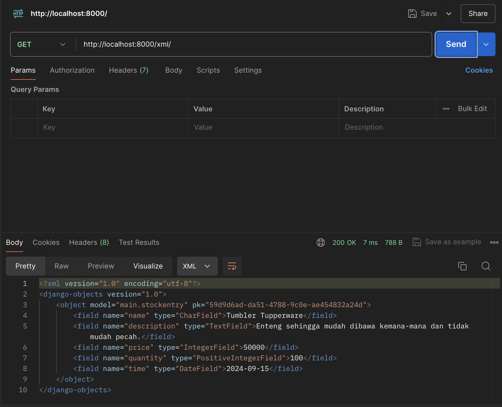
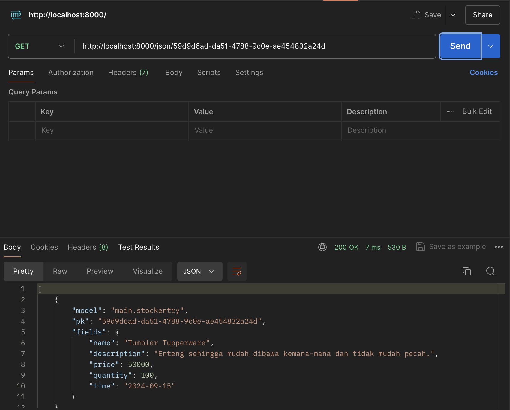
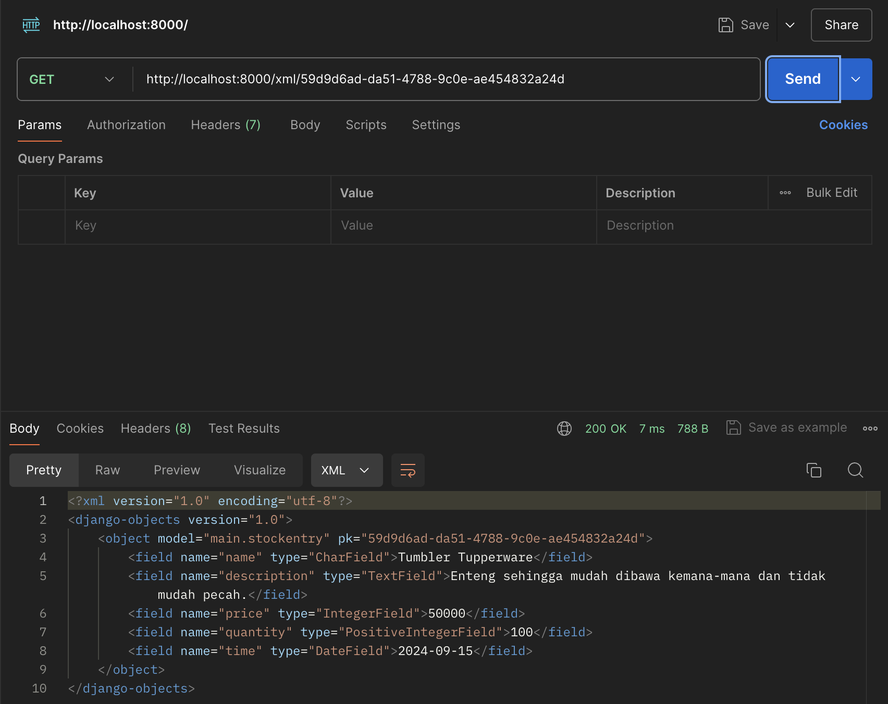

# Implementasi Checklist:
## Membuat Proyek Django Baru:
1. Membuat direktori baru dengan nama kiosku
2. Mengaktifkan environment pada direktori 
3. Buat berkas requirements.txt yang berisikan dependencies
4. Install dependencies
5. Buat proyek django dengan nama kiosku
## Membuat aplikasi dengan nama main pada proyek tersebut:
1. Jalankan perintah python manage.py startapp main pada direktori kiosku
2. Daftarkan aplikasi main ke settings.py
3. Tambahkan main ke variabel installed apps
## Melakukan routing pada proyek agar dapat menjalankan aplikasi main.
1. Membuka urls.py yang ada di direktori proyek 'lodon_mart' (bukan direktori main).
2. import path,include dari modul django.urls.
3. Menambahkan dalam list url_patterns ( yang awalnya hanya berisi path('admin/', admin.site.urls) ) dengan path('', include('main.urls')).
## Membuat model pada aplikasi main dengan nama Product
1. Membuka models.py dalam direktori aplikasi 'main'.
2. Membuat class baru bernama Product dengan parameter models.Model.
3. Menambahkan atribut name dengan tipe charField, price dengan tipe IntegerField, dan description dengan tipe TextField.
## Membuat sebuah fungsi pada views.py untuk dikembalikan ke dalam sebuah template HTML yang menampilkan nama aplikasi serta nama dan kelas
1. Buka berkas views.py yang terletak di dalam berkas aplikasi main.
2. Apabila belum ada, tambahkan baris-baris import from django.shortcuts import render di bagian paling atas berkas.
3. Tambahkan fungsi show_main yang me-return render(request, "main.html", context)
4. Ubah variable dan isi sesuai dengan yang dibutuhkan.
## Membuat sebuah routing pada urls.py aplikasi main untuk memetakan fungsi yang telah dibuat pada views.py.
1. Pada file urls.py di direktori main, import path dari modul django.urls.
2. Import fungsi show_main dari main.views.
3. Inisialisasi variabel untuk menyimpan nama aplikasi yaitu 'main'.
4. Membuat list dengan isi path('', show_main, name ='show_main').
## Melakukan deployment ke PWS terhadap aplikasi yang sudah dibuat
1. Login ke akun PWS yang sudah dibuat
2. Create new project dan buat project name dengan nama kiosku
3. Simpan credential username dan password
4. Tambahkan URL deployment PWS ke settings.py
5. Menjalankan instruksi yang ada di bagian project command di PWS

# Bagan request client

## Penjelasan
1. Klien mengirimkan request http ke server
2. urls.py menentukan rute URL yang menghubungkan URL tertentu ke view yang sesuai.
3. views.py menangani logika aplikasi dan memproses permintaan yang diterima.
4. models.py menyediakan model data yang dihubungkan dengan basis data.
5. Html template menyediakan struktur HTML untuk merender respons yang dikirim kembali ke klien.
6. Client response merupakan respons akhir yang dikirim kembali ke klien.

# Fungsi git dalam pengembangan perangkat lunak

## Version Control:
untuk melacak perubahan yang dilakukan pada kode sumber dari waktu ke waktu.

## Kolaborasi Tim:
Untuk membantu banyak pengembang mengerjakan proyek bersama
## Reversi dan Pemulihan:
memfasilitasi pemulihan dari kesalahan atau pengembalian ke versi sebelumnya:
## Manajemen Proyek: 
membantu dalam mengelola dan memantau perkembangan proyek

# Framework Django
Menurut saya Django memiliki dokumentasi yang lengkap sehingga memudahkan pemula untuk belajar. Selain itu, Django juga memiliki komunitas yang aktif sehingga memudahkan pembelajaran dan pemecahan masalah. Di Fasilkom sendiri python merupakan bahasa pemrograman di DDP 1 sehingga untuk mempelajari Django sebagai mahasiswa Fasilkom tidak butuh banyak penyesuaian.

# Django disebut ORM
Django disebut ORM karena Django memetakan langsung basis data ke object pada Python sehingga tidak diperlukan lagi menulis query SQL secara langsung.

# TUGAS 3
# Fungsi Data Delivery
Data delivery diperlukan karena memungkinkan transfer dan pertukaran informasi yang efisien antara berbagai komponen sistem, pengguna, atau perangkat. Dalam konteks e-commerce, data delivery memastikan bahwa informasi penting seperti produk, transaksi, dan status pengiriman dapat diakses, diproses, dan dikelola dengan baik.

# Perbandingan JSON dan XML
Saya pribadi lebih memilih JSON karena lebih sederhana dan lebih mudah dibaca dibandingkan dengan XML. JSON menggunakan lebih sedikit karakter dan memiliki struktur yang lebih ringkas daripada XML yang menggunakan banyak tag. Menurut saya hal itu juga yang membuat JSON lebih populer dibanding XML.

# Fungsi Method is_valid() pada Form Django
Method is_valid() pada form Django memiliki peran penting dalam memverifikasi data yang dimasukkan ke dalam form. Kita membutuhkan method tersebut untuk memeriksa apakah data yang dikirim melalui form memenuhi semua aturan validasi yang telah ditentukan, baik itu validasi default dari Django maupun validasi kustom yang kita buat.

# CSRF Token
Kita membutuhkan csrf_token karena Django memberikan csrf_token untuk memastikan bahwa setiap permintaan POST berasal dari sumber yang sah, yaitu form yang dibuat oleh aplikasi sendiri dan bukan dari situs pihak ketiga yang berbahaya. Jika kita tidak menambahkan csrf_token pada form Django, aplikasi akan menjadi rentan terhadap serangan CSRF. Tanpa csrf_token, aplikasi tidak memiliki mekanisme untuk membedakan antara permintaan yang sah dari form di situs dengan permintaan yang berasal dari sumber berbahaya. Serangan CSRF memanfaatkan hubungan kepercayaan antara pengguna yang telah login dan server. Karena browser secara otomatis mengirimkan cookie sesi dalam setiap permintaan, penyerang dapat membuat permintaan berbahaya yang terlihat sah dari perspektif server.

# Implementasi Checklist

## Membuat input form untuk menambahkan objek model pada app sebelumnya.
1. Buat berkas baru pada direktori main dengan nama forms.py untuk membuat struktur form yang dapat menerima data Mood Entry baru.
2. Buka berkas views.py yang ada pada direktori main dan tambahkan from django.shortcuts import render, redirect ; from main.forms import StockEntryForm ; from main.models import StockEntry pada bagian paling atas.
3. buat fungsi baru dengan nama create_stock_entry yang menerima parameter request.
4. Buka urls.py yang ada pada direktori main dan import fungsi create_mood_entry yang sudah dibuat tadi.
5. Tambahkan path URL ke dalam variabel urlpatterns pada urls.py di main untuk mengakses fungsi yang sudah di-import pada poin sebelumnya.
6. Buat berkas HTML baru dengan nama create_stock_entry.html pada direktori main/templates. Isi create_stock_entry.html dengan kode berikut.
7. Buka main.html dan tambahkan kode untuk menampilkan data mood dalam bentuk tabel serta tombol "Add New Mood Entry" yang akan redirect ke halaman form di dalam . 

## Tambahkan 4 fungsi views baru untuk melihat objek yang sudah ditambahkan dalam format XML, JSON, XML by ID, dan JSON by ID.
1. Buka views.py yang ada pada direktori main dan tambahkan import HttpResponse dan Serializer pada bagian paling atas.
2. Buatlah sebuah fungsi baru yang menerima parameter request dengan nama show_xml dan show_json kemudian buatlah sebuah variabel di dalam fungsi tersebut yang menyimpan hasil query dari seluruh data yang ada pada StockEntry.
3. Tambahkan return function berupa HttpResponse di show_xml yang berisi parameter data hasil query yang sudah diserialisasi menjadi XML dan parameter content_type="application/xml".
7. Tambahkan return function berupa HttpResponse di show_json yang berisi parameter data hasil query yang sudah diserialisasi menjadi JSON dan parameter content_type="application/json".
10. Pada file yang sama buatlah dua fungsi baru yang menerima parameter request dan id dengan nama show_xml_by_id dan show_json_by_id.
11. Buatlah sebuah variabel di dalam fungsi tersebut yang menyimpan hasil query dari data dengan id tertentu yang ada pada StockEntry.
12. Tambahkan return function berupa HttpResponse yang berisi parameter data hasil query yang sudah diserialisasi menjadi JSON atau XML dan parameter content_type dengan value "application/xml" (untuk format XML) atau "application/json" (untuk format JSON).

## Membuat routing URL untuk masing-masing views yang telah ditambahkan pada poin 2.
1. Buka urls.py yang ada pada direktori main dan import fungsi yang sudah dibuat tadi (from main.views import show_main, create_mood_entry, show_xml, show_json, show_xml_by_id, show_json_by_id).
2. Tambahkan path url ke dalam urlpatterns untuk mengakses fungsi yang sudah diimpor tadi (path('', show_main, name='show_main'), path('create-stock-entry', create_stock_entry, name='create_stock_entry'), path('xml/', show_xml, name='show_xml'), path('json/', show_json, name='show_json'), path('xml/<str:id>/', show_xml_by_id, name='show_xml_by_id'), path('json/<str:id>/', show_json_by_id, name='show_json_by_id'),).

# Akses Menggunakan Postman

